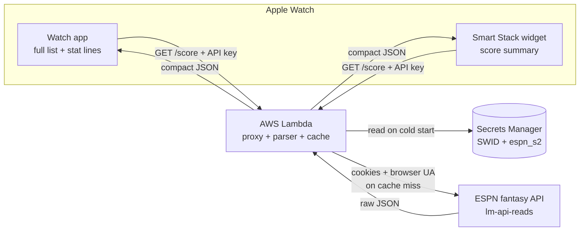

# Fantasy Watch — Live Score & Stats: Design Document

2026-09-19 · @Someone

## Overview & goals

Build a personal watchOS app plus a Smart Stack widget that shows the live score of your ESPN fantasy matchup ("The Christian Faith", team 7, league 1896305934), every starter's live fantasy points, and an ESPN-style stat line per player (e.g. `7 rec, 69 yd, 1 TD`). The data comes from ESPN's unofficial fantasy API, which requires your account cookies — so an AWS Lambda proxy holds those cookies and hands the watch a clean, cookie-free payload, which the watch polls as often as each surface allows.

Goals, in priority order:

1. **Full matchup at a glance** — both team totals, win probability, and all nine starters with live points.
2. **ESPN-style stat lines** — each player's box-score summary, formatted by position.
3. **As fresh as the platform permits** — near-live when the app is open on your wrist; best-effort on the widget (see the refresh-strategy section for why these differ).
4. **Credentials never on the device** — cookies live only in the Lambda's secret store.
5. **Personal use** — one league, one user; not an App Store product (the ESPN API is unofficial and against its terms for redistribution).

Non-goals: multi-league support, historical analysis, roster editing, or anything that writes back to ESPN.

## System architecture

Four components, with the Lambda as the only thing that ever sees your ESPN cookies. The watch talks only to the Lambda; the Lambda talks to ESPN.



Data flow, per request: the watch sends a plain `GET` with a client API key (no cookies); the Lambda checks its short-TTL cache; on a miss it reads the cookies from Secrets Manager (cached in memory across warm invocations), calls ESPN with those cookies and a browser `User-Agent`, parses the raw response down to the fields the watch needs, caches it, and returns it. On a hit it returns the cached payload without touching ESPN — this is what lets the watch poll frequently without burning ESPN rate limits or your cookies.

The watch reaches the Lambda over the internet directly: on a cellular watch this works standalone; otherwise the request routes through the paired iPhone (when nearby) or Wi-Fi. No WatchConnectivity relay is needed, because nothing on the phone is required to fetch the data.

## Data source: the ESPN fantasy API

There is no official public ESPN fantasy API; this uses the same undocumented endpoint the ESPN site itself calls. Reads go through the `lm-api-reads` host (the plain `fantasy.espn.com` host stopped serving these and returns errors):

```
GET https://lm-api-reads.fantasy.espn.com/apis/v3/games/ffl/seasons/2026/segments/0/leagues/1896305934?view=mMatchupScore&view=mScoreboard
```

Because the league is private, every request must carry two cookies — `SWID` and `espn_s2` — or ESPN returns `401`. These were confirmed against your data: without them the endpoint 401s; with them it returns the full matchup. Key facts established from your league's actual response:

- Scoring is **PPR** (1.0 point per reception — verified from the applied stats).
- The live team total is `totalPointsLive`; `totalPoints` stays `0.0` until ESPN finalizes, so the app must read the `Live` field.
- Per-player live points are on each roster entry as `playerPoolEntry.appliedStatTotal`.
- Per-player raw box-score stats are under `player.stats[]`, in the split where `statSourceId == 0` and `scoringPeriodId` matches the current week — this is the source for the stat lines.

The important caveat: this API is unofficial and unstable. It has changed hosts and versions before with no notice (the v2→v3 migration in 2019, the host move that caused the earlier "nothing loads"). The cookies also expire periodically. The design isolates all of this fragility inside the Lambda so a break never means shipping a new watch build.

## AWS Lambda proxy design

A single Lambda behind a **Function URL** (simplest; API Gateway is optional and only needed if you want throttling/usage plans). It does five things: authenticate the caller, serve from cache, fetch ESPN on a miss, parse to the compact model, and surface auth failures cleanly.

**Caching is what makes "as often as it can" safe.** The watch may poll every \~20 seconds, but ESPN should be hit far less. A short-TTL cache absorbs the gap:

- **In-memory cache** on the warm container (a module-level variable), TTL \~20–30s. Most polls during a warm burst are served from here — zero ESPN calls, sub-100ms responses.
- Optionally a **DynamoDB table with a TTL attribute** as a shared cache across cold containers, so a fresh container doesn't always re-hit ESPN. For one user, in-memory alone is usually enough.
- The TTL is the real "live-ness" knob: 20s means ESPN sees at most \~3 calls/min no matter how often the watch asks. Fantasy scoring updates on roughly that cadence anyway, so nothing is lost.

**Secrets.** `SWID` and `espn_s2` live in **AWS Secrets Manager** (or encrypted Lambda env vars for a simpler start). The Lambda reads them once per cold start and holds them in memory. They are never returned to the client and never logged.

**Endpoint auth.** The Function URL is protected by a static client API key the watch sends in a header (e.g. `x-api-key`). This stops the open internet from hammering your endpoint and, indirectly, your ESPN cookies. Keep the key in the watch app's build config, not in source control.

**Request / response contract:**

|  |  |
| --- | --- |
| Method | `GET /score` |
| Auth header | `x-api-key: <client key>` |
| Success | `200` + compact JSON (next section) |
| Cookies stale | `401` from ESPN → Lambda returns `{ "state": "auth_expired" }` with HTTP `200` so the watch can show a friendly "reconnect" state |
| ESPN down / other | `502` + `{ "state": "upstream_error" }` |

**Cold-start note.** Fetch + parse is light (tens of ms of compute); the only slow path is a cold start reading Secrets Manager. Provisioned concurrency is overkill for personal use — accept the occasional \~1s cold start.

Language is your choice; Node.js or Python both fit in a single file. The parser is the only non-trivial code, and it's the same logic already validated against your JSON: find the matchup for `currentMatchupPeriod`, locate team 7, read `totalPointsLive` for both sides, and walk each roster's starters building points + stat lines.

## Response data model

The Lambda collapses ESPN's large response into a compact payload the watch decodes directly into Swift structs. Shape:

```json
{
  "state": "ok",
  "week": 2,
  "updated": "2026-09-19T17:40:00Z",
  "me":  { "team": "The Christian Faith", "live": 47.62, "projected": 142.6, "winProb": 0.69 },
  "opp": { "team": "Team Tits",          "live": -0.1,  "projected": 108.6, "winProb": 0.31 },
  "players": [
    {
      "name": "Josh Allen",
      "slot": "QB",
      "proTeam": "BUF",
      "gameState": "final",
      "points": 40.82,
      "statLine": "20/31, 248 yd, 3 TD · 14 car, 69 yd, 2 TD",
      "side": "me"
    }
  ]
}
```

Field notes:

- `players` carries **both** lineups (each tagged `side: "me" | "opp"`) so the watch can show either team without a second request.
- `gameState` is `pre` | `live` | `final`, letting the UI show "yet to play" instead of a misleading `0.0`. Deriving it accurately needs a small enrichment (see stat-line and refresh sections); a v1 can approximate it as "has any stat yet".
- `updated` is the Lambda's fetch time, so the watch can show "as of 30s ago".
- Keep numbers as numbers (not strings) and round server-side to one decimal to keep the payload tiny — it should be a couple of KB, which matters on a watch radio.

This contract is the seam between the two halves of the project: once it's frozen, the Lambda and the watch app can be built and tested independently against a sample payload.

## Stat line construction

ESPN's raw `player.stats[]` split (the one with `statSourceId == 0` for the current `scoringPeriodId`) is a dictionary keyed by numeric **stat IDs**. The Lambda maps those IDs to labels and formats them by position. These IDs were read directly from your league's data (Josh Allen and Khalil Shakir), so they're verified for the offensive skill positions:

| Stat ID | Meaning | Example (Josh Allen, Wk 2) |
| --- | --- | --- |
| 0 | Pass attempts | 31 |
| 1 | Pass completions | 20 |
| 3 | Passing yards | 248 |
| 4 | Passing TDs | 3 |
| 20 | Interceptions thrown | — |
| 23 | Rush attempts | 14 |
| 24 | Rushing yards | 69 |
| 25 | Rushing TDs | 2 |
| 53 | Receptions | (Shakir: 3) |
| 42 | Receiving yards | (Shakir: 38) |
| 43 | Receiving TDs | — |
| 58 | Targets | (Shakir: 6) |

Formatting rules, matching how ESPN renders each position:

- **QB** — `comp/att, yds, TD` and, if any rushing, `  · car, yds, TD `. Add `, N INT` when interceptions > 0. → `20/31, 248 yd, 3 TD · 14 car, 69 yd, 2 TD`
- **RB** — `car, yds, TD` then receiving `  · rec, yds, TD ` if targeted. → `18 car, 92 yd, 1 TD · 3 rec, 20 yd`
- **WR / TE** — `rec, yds, TD` (this is the `7 rec, 69 yd, 1 TD` you asked for), optionally leading with targets.
- **K** — made/attempted field goals and extra points: `3/3 FG, 2/2 XP`.
- **D/ST** — points allowed plus event tallies: `10 PA, 2 sack, 1 INT, 1 TD`.

Build rule: only include a clause when its stat is non-zero, so a WR with no score reads `— yet to play` rather than a string of zeros. Suppress the whole line and show `gameState` when `pre`.

**To finish the map:** the K and D/ST stat IDs aren't in your skill-position sample, so confirm them empirically (inspect a kicker and a defense in a week where they've scored) or against a community reference such as the `espn-api` stat map. Keep the ID→label table as a single constant in the Lambda so additions are one-line. Note ESPN occasionally reuses IDs across contexts, so validate against real output rather than trusting any single list.

## Watch app & widget surfaces

Two surfaces with different jobs: the **app** shows everything; the **widget** shows the headline. Both decode the same payload.

**The watch app (full detail).** A `List` in SwiftUI: a header row with your total vs. opponent total and a win-probability bar, then one row per starter — position badge, player name, live points, and the stat line beneath in caption text. A tab or swipe flips between your lineup and the opponent's (both are already in the payload). This is where all nine players and their stat lines live, since only the app has the screen space for them.

**The Smart Stack widget (glance).** Widgets are small, so it shows the score, not the roster. Useful families:

| Family | Shows | Use |
| --- | --- | --- |
| `accessoryRectangular` | `You 47.6 – 0.1 Opp` + win% or top scorer | Primary Smart Stack widget |
| `accessoryInline` | `CF 47.6 – 0.1` | Thin line above the watch face |
| `accessoryCircular` | Your live total only | Complication-style corner |

Tapping the widget deep-links into the app for the full breakdown. The widget can't list every player — that's by design, and it's why the app exists alongside it.

**Code reuse.** The networking layer, the Codable models, and the payload decoding are one Swift package shared by the app target and the widget extension target. Only the views differ. The stat-line formatting already happened in the Lambda, so the watch never touches stat IDs.

## Refresh strategy & the "live" reality

"As often as it can" means something different on each surface, and this is the single most important thing to get right in expectations. The app can poll on a timer; the widget cannot — watchOS controls when widgets reload, on a limited daily budget.

| Surface | How it refreshes | Realistic cadence |
| --- | --- | --- |
| App (foreground) | Your own polling loop | Every \~20–30s while open — near-live |
| App (backgrounded) | Stops polling | Not live |
| Widget (Smart Stack) | WidgetKit timeline, system-scheduled | Best-effort; minutes apart, not seconds |

**App polling (where near-live happens).** When the app is in the foreground, run an async loop that hits the Lambda every 20–30 seconds and updates the UI, cancelled the moment the app backgrounds. Since the Lambda caches for \~20s, polling faster than that just returns cached data — so 20–30s is the sweet spot: responsive without waste. This is the surface to use when you actually want to watch the score move.

**Widget timeline (best-effort).** The widget's `TimelineProvider` fetches the payload, returns a single entry, and sets a short refresh policy (e.g. `.after(15 minutes)`) during games. watchOS honors this only within its budget — a handful to a few dozen reloads per day — so the widget will lag the app. Raise the entry's `relevance` during game windows so the Smart Stack floats it to the top when it matters, and lower it otherwise.

**Optional: push for a fresher widget.** To push the widget closer to live, add an EventBridge schedule that triggers a small Lambda every minute during game windows; when the score changes it sends an APNs push that wakes the app to call `WidgetCenter.reloadTimelines`. This is real added infrastructure (APNs certificates, device tokens, a scheduler) and is a v2 enhancement — the polling app already covers the "I want to watch it live" case without it.

**Bottom line:** open the app on your wrist for live; treat the widget as a frequently-updated glance, not a live ticker. Designing around that split avoids the classic disappointment of expecting a widget to tick like a stopwatch.

## Security, token expiry & failure modes

The cookies are effectively a logged-in session for your ESPN account, so the whole design keeps them in exactly one place and plans for their expiry.

**Handling principles:**

- Cookies live only in Secrets Manager, read by the Lambda, never sent to the device or written to logs.
- The Function URL requires a client API key so the endpoint isn't open to the world.
- Rotate the cookies you shared earlier in chat — log out of ESPN on the web (which invalidates that `espn_s2`), grab fresh values, and put them straight into Secrets Manager.
- Refresh cadence: expect to re-grab cookies every few weeks. When ESPN returns `401`, that's the signal.

**Failure modes and responses:**

| Failure | Detection | Response |
| --- | --- | --- |
| Cookies expired | ESPN returns `401` | Lambda returns `auth_expired`; watch shows "Reconnect"; you refresh the secret |
| ESPN changes host/endpoint | Non-JSON or repeated `5xx` | Update the URL in the Lambda only; no app rebuild |
| ESPN rate-limits | `429` | Cache TTL already caps call rate; back off and serve last-good |
| Watch offline | Request fails on device | Show last-fetched score with its `updated` timestamp |
| Between weeks / bye | No current matchup found | Lambda returns an empty-state payload the app renders gracefully |

**Serve last-good.** The Lambda (and optionally the watch) should keep the last successful payload so a transient ESPN hiccup shows a slightly stale score rather than an error — with the `updated` field making the staleness honest.

Because everything ESPN-specific and secret is server-side, the failure that would otherwise be worst (ESPN breaks mid-season) becomes a one-line edit in the Lambda instead of an emergency App Store submission.

## Build phases / milestones

Build the data path before the UI, so each layer is proven against real data before the next depends on it.

1. **Lambda, hardcoded first.** Function URL that fetches ESPN with cookies from env vars and returns raw JSON. Validates cookies + host + User-Agent end to end. *Done when: hitting the URL returns your live matchup.*
2. **Parser + contract.** Add the parsing already validated against your file — matchup lookup, `totalPointsLive`, per-player points, stat lines — and emit the compact payload. *Done when: the URL returns the clean `{ me, opp, players[] }` JSON.*
3. **Harden the Lambda.** Move cookies to Secrets Manager, add the client API key, add the \~20s cache, add `auth_expired` / error states. *Done when: it's safe to call from the open internet.*
4. **Watch app skeleton.** Xcode project with watch app + shared networking package; decode the payload; render the matchup header and the starter list with stat lines. *Done when: your real lineup shows on the simulator.*
5. **Foreground polling.** The 20–30s loop with start/stop on foreground/background, and last-good caching. *Done when: the score updates itself while the app is open.*
6. **Widget extension.** `accessoryRectangular` score widget with a `TimelineProvider` and relevance; deep-link into the app. *Done when: it appears and updates in the Smart Stack on your own watch.*
7. **On-device + polish.** Run on your physical watch (needs the paid developer account), tune relevance windows, empty/bye states, error UI.
8. **Optional v2.** APNs push + EventBridge for a fresher widget; opponent-lineup tab; D/ST and K stat-line completion.

Phases 1–3 are pure backend and can be tested with `curl` alone; phases 4–6 are the app. The frozen contract (phase 2) is what lets you work on either side independently.

## Cost estimate

At personal scale (one user, polling only while you're watching games), running costs are effectively zero — the only real cost is the Apple Developer account.

| Item | Cost | Notes |
| --- | --- | --- |
| Apple Developer Program | $99 / year | Required to run on your physical watch beyond 7-day free provisioning, and for any push features |
| AWS Lambda | \~$0 | Free tier is 1M requests + 400k GB-s/month; you'll use a tiny fraction |
| Lambda Function URL | $0 | No extra charge |
| Secrets Manager | \~$0.40 / month | Per stored secret; or use encrypted env vars for $0 |
| DynamoDB cache (optional) | \~$0 | Free tier covers this trivially; skip it and it's nothing |
| APNs (optional v2) | $0 | Included with the developer account |

The usage math: even polling every 20s for, say, 10 hours of games a week is roughly 1,800 requests/week — about 7,800/month, versus a 1,000,000-request free tier. You will not approach any paid threshold. The design's caching also keeps ESPN-facing calls well under its informal limits.

So: **$99/year all-in**, and $0 of it is variable.

## Open questions & risks

Things to decide or watch, none of them blocking:

- **Lambda language** — Node.js or Python? Both fit; pick whichever you'd rather maintain. (Leaning Node for a single-file Function URL.)
- **K and D/ST stat IDs** — not in the sampled data; confirm empirically before those positions show correct stat lines.
- **`gameState` accuracy** — showing a true "yet to play" vs "final" needs mapping each player's pro team to live NFL game state, likely via ESPN's public NFL scoreboard endpoint as a second call in the Lambda. A v1 can approximate; decide if the accurate version is worth the extra call.
- **ESPN fragility** — the standing risk: the endpoint can change without notice. Mitigated by keeping all ESPN logic in the Lambda, but accept that occasional maintenance is part of owning this.
- **Cookie refresh friction** — every few weeks you'll re-copy cookies into Secrets Manager. Tolerable, but if it grates, a future option is a tiny scripted refresh.
- **Scope creep** — opponent lineup, multiple leagues, and push are all tempting; the phased plan keeps them explicitly in v2.

None of these needs an answer before starting phase 1 (the Lambda), which is the natural next step.
